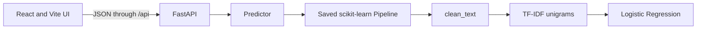
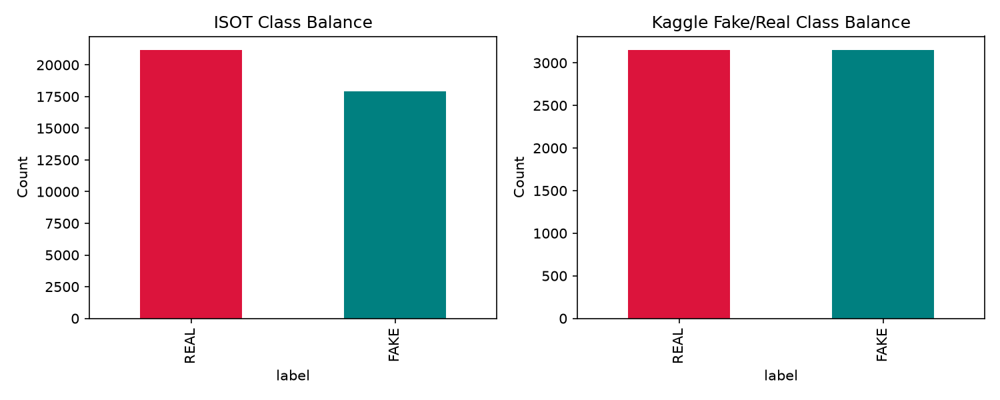
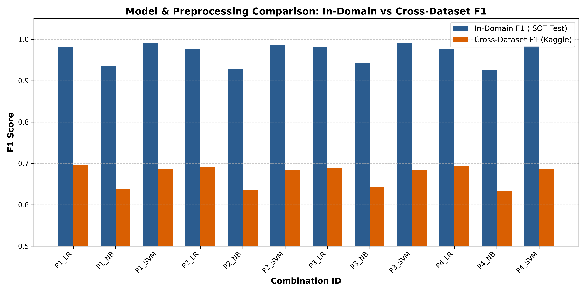
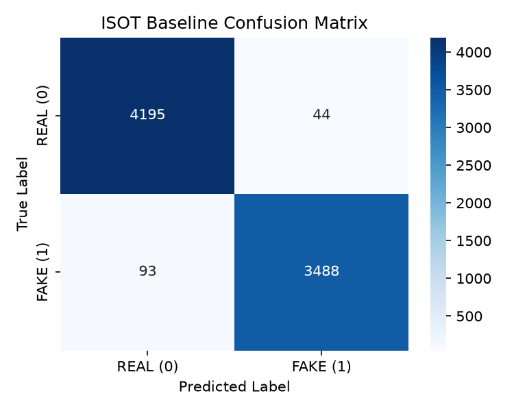
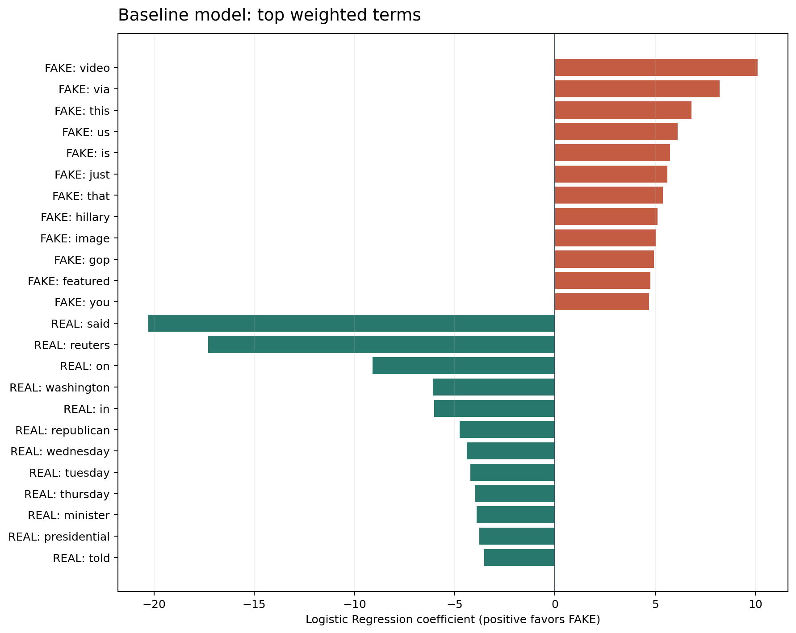
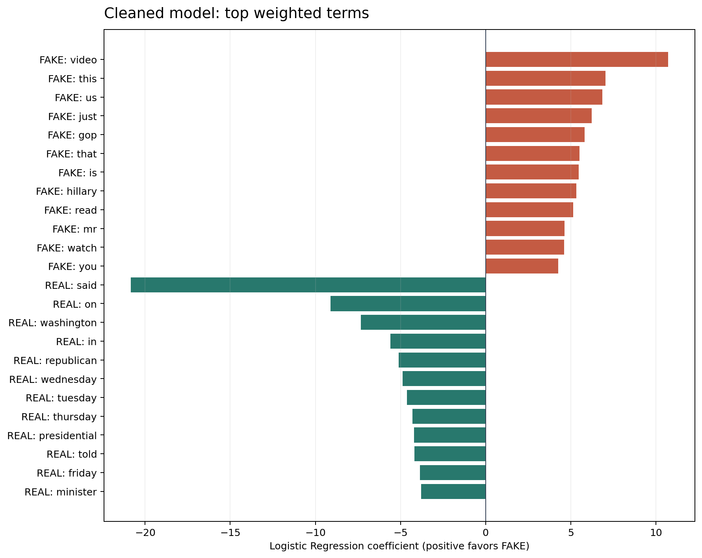
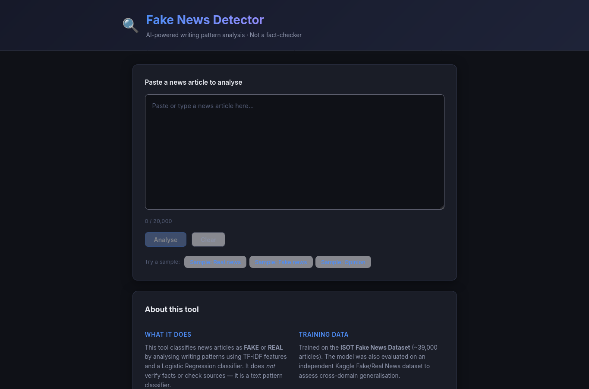
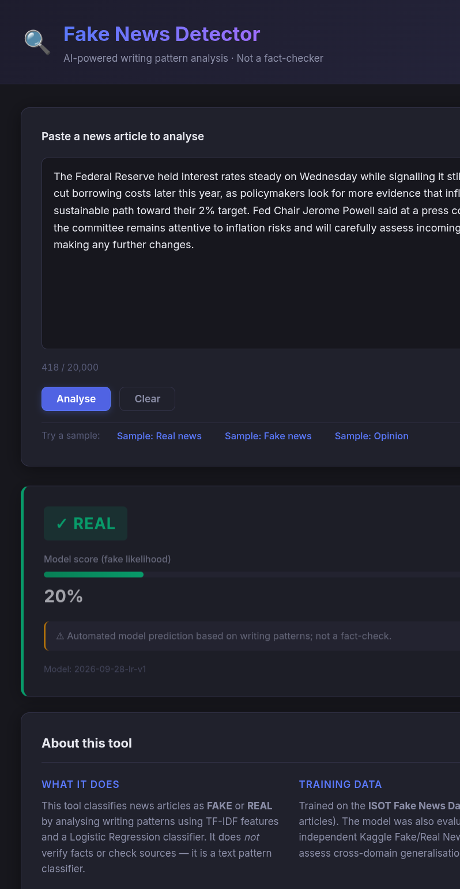

# Fake News Detection Using NLP

A web app that classifies a pasted news article as **FAKE** or **REAL** using TF-IDF features and a scikit-learn classifier, served through FastAPI and a React UI.

> It is a **text classifier**, not a fact-checker. It predicts whether text resembles the fake or real articles in its training data. It does not verify claims.

## Stack

| Layer    | Tech                                                                                  |
| -------- | ------------------------------------------------------------------------------------- |
| ML / NLP | Python 3.11+, pandas, scikit-learn (`Pipeline`: cleaning, TF-IDF, classifier), joblib |
| Backend  | FastAPI + Uvicorn                                                                     |
| Frontend | React + Vite                                                                          |
| Tooling  | Git, venv, Jupyter, pytest                                                            |

## Repository layout

```text
fake-news-detection/
├── AGENTS.md              # rules every AI agent must follow (READ FIRST)
├── README.md
├── requirements.txt
├── .gitignore
├── .github/copilot-instructions.md
├── Documents/docs/
│   ├── SRS.md             # what we are building
│   ├── ARCHITECTURE.md    # how the pieces fit + contracts
│   ├── ROADMAP.md         # phase overview
│   ├── PROGRESS.md        # checklist, update after each phase
│   ├── DECISIONS.md       # decision log
│   ├── Learning.md        # human study guide: ML/NLP concepts explained (agents need not read)
│   ├── LEARNING_LOG.md    # your own notes per phase
│   └── phases/phase-00 ... phase-09
├── ml/                    # python package: data, training, prediction
│   ├── data/raw|processed # gitignored
│   ├── notebooks/
│   ├── src/               # config, data, preprocess, train, predict, ...
│   ├── models/            # pipeline.joblib (gitignored) + model_card.json
│   └── reports/           # metrics, figures, error analysis (committed)
├── backend/               # FastAPI app
├── frontend/              # React app
└── tests/
```

## How to work on this project (humans and agents)

1. Read `AGENTS.md`, then `Documents/docs/ARCHITECTURE.md`.
2. Open `Documents/docs/PROGRESS.md` and find the first unfinished phase.
3. Open that phase file in `Documents/docs/phases/`. Do **only** that phase.
4. Verify every item under "Definition of Done", then tick it in `Documents/docs/PROGRESS.md`, add notes to `Documents/docs/LEARNING_LOG.md`, and commit.
5. Start the next phase in a fresh agent session so context stays small.

## Quick start

```bash
python3 -m venv .venv
.venv/bin/python -m pip install -r requirements.txt
```

## Dataset setup

Both datasets are gitignored and must be downloaded manually. Open each Kaggle page, click **Download**, unzip the archive, and place the CSV files at these paths:

- [Fake and Real News Dataset (ISOT)](https://www.kaggle.com/datasets/clmentbisaillon/fake-and-real-news-dataset)
  - `ml/data/raw/isot/Fake.csv`
  - `ml/data/raw/isot/True.csv`
  - License / usage: Open for academic and research evaluation.
- [Fake or Real News](https://www.kaggle.com/datasets/jillanisofttech/fake-or-real-news)
  - `ml/data/raw/second/fake_or_real_news.csv`
  - License / usage: Open dataset for educational classification tasks.

After placing the files, generate the ignored model artifact from the repository root:

```bash
.venv/bin/python -m ml.src.train
```

Then install the frontend dependencies and start both servers:

```bash
cd frontend
npm install
cd ..
bash scripts/dev.sh
```

Open http://localhost:5173. The dev script starts the API on http://localhost:8000 and the Vite frontend on http://localhost:5173. Run the Python setup and training commands from the repository root.

> **Security note:** Loading a `joblib` / `pickle` artifact executes pickled Python code. Only load `pipeline.joblib` files generated by your own training runs.

## Features

- Classifies pasted article text as `FAKE` or `REAL` and displays the model score and a disclaimer.
- Rejects input shorter than 20 characters or longer than 20,000 characters.
- Provides health and model information endpoints and a FastAPI `/docs` page.
- The model analyzes writing patterns. It does not verify claims, inspect sources, or fact-check an article.

## Architecture



Training is offline. The training command loads the prepared datasets, fits the pipeline on the training split, evaluates it, and saves the model artifact and model card. The API loads that saved pipeline at startup.

## Dataset Summary

Both datasets are manually downloaded; the CSV files are gitignored. Source links, target paths, and license notes are in [Dataset setup](#dataset-setup).

| Dataset | Clean rows | FAKE | REAL | Dropped as duplicates / invalid |
|---|---:|---:|---:|---:|
| ISOT | 39,100 | 17,905 (45.79%) | 21,195 (54.21%) | 5,798 |
| Kaggle Fake or Real News | 6,305 | 3,151 (49.98%) | 3,154 (50.02%) | 30 |

Counts and class balance are from [`eda_summary.md`](ml/reports/eda_summary.md).



## NLP Pipeline

The final pipeline applies `clean_text`, unigram TF-IDF with at most 50,000 features, and Logistic Regression. `FAKE` is label 1 and `REAL` is label 0. Cleaning removes identified publisher and formatting artifacts; fitting the vectorizer inside the pipeline keeps its vocabulary learned only from training data.

## Experiments

The table reports every tested preprocessing/classifier combination. CV F1 is the five-fold stratified mean and standard deviation; the held-out test and cross-dataset metrics and fit times come from [`experiments.csv`](ml/reports/experiments.csv).

| Combination | CV F1 mean ± SD | ISOT test F1 | Second-dataset F1 | Fit time (s) |
|---|---:|---:|---:|---:|
| P1_LR | 98.31% ± 0.20% | 98.07% | 69.63% | 16.43 |
| P4_LR | 97.45% ± 0.23% | 97.60% | 69.35% | 37.58 |
| **P2_LR (selected)** | **97.70% ± 0.29%** | **97.62%** | **69.13%** | **39.00** |
| P3_LR | 98.04% ± 0.26% | 98.20% | 68.94% | 80.46 |
| P4_SVM | 98.41% ± 0.16% | 98.37% | 68.67% | 36.14 |
| P1_SVM | 99.24% ± 0.06% | 99.16% | 68.65% | 16.16 |
| P2_SVM | 98.62% ± 0.14% | 98.64% | 68.50% | 37.77 |
| P3_SVM | 98.97% ± 0.15% | 99.09% | 68.39% | 81.71 |
| P3_NB | 94.49% ± 0.36% | 94.38% | 64.42% | 74.31 |
| P1_NB | 93.56% ± 0.43% | 93.56% | 63.68% | 15.34 |
| P2_NB | 93.01% ± 0.43% | 92.90% | 63.45% | 34.45 |
| P4_NB | 92.70% ± 0.36% | 92.59% | 63.27% | 35.49 |

P1_LR has a slightly higher cross-dataset F1, but it uses raw text and retains publisher artifacts. P2_LR was selected for its explicit artifact cleaning, native `predict_proba`, and competitive performance. The comparison and rationale are recorded in [`model_selection.md`](ml/reports/model_selection.md) and [`leakage_report.md`](ml/reports/leakage_report.md).



## Results

The final artifact is P2_LR, model version `2026-09-28-lr-v1`. Its in-domain and cross-dataset results are shown side by side; the second dataset is an unseen evaluation set, not training data.

| Evaluation | Accuracy | Precision (FAKE) | Recall (FAKE) | F1 (FAKE) |
|---|---:|---:|---:|---:|
| ISOT held-out test | 97.84% | 98.44% | 96.82% | 97.62% |
| Kaggle Fake or Real News | not reported | not reported | not reported | 69.13% |

The ISOT metrics and cross-dataset F1 are from [`experiments.csv`](ml/reports/experiments.csv), corroborated by [`model_selection.md`](ml/reports/model_selection.md) and [`leakage_report.md`](ml/reports/leakage_report.md). Other cross-dataset metrics are not reported in `ml/reports/`. The cross-dataset results document a substantial domain shift; they should not be presented as real-world fact-checking performance.







The baseline's strongest weights include publisher markers such as `reuters`, `via`, and `featured`; the cleaned model removes these specific artifacts. See [`leakage_report.md`](ml/reports/leakage_report.md) for the analysis and examples.

## UI Screenshots





## Limitations

- The model learns correlations in two historical datasets and can fail on newer events, different publishers, unfamiliar topics, satire, opinion, or international reporting.
- A high in-domain score does not establish generalization; cross-dataset F1 is 69.13% in this evaluation.
- The displayed score is an uncalibrated class score, not the probability that an article is true or false.
- The labels are dataset labels and may reflect source selection, annotation, and collection biases.
- The app is a classroom text-classification demonstration, not a fact-checking or moderation system.

## Future Scope

Possible next experiments include broader and more recent datasets, temporal and source-held-out evaluation, probability calibration, and comparisons with transformer-based or explainability methods. These are future work and are not implemented features.

## Reports and Reproducibility

Detailed metrics, cleaning analysis, errors, and selection rationale are in [`ml/reports/`](ml/reports/). The API contract and system boundaries are described in [`Documents/docs/ARCHITECTURE.md`](Documents/docs/ARCHITECTURE.md). Use the commands above to install dependencies, add the datasets, train the ignored model artifact, and start the app.
